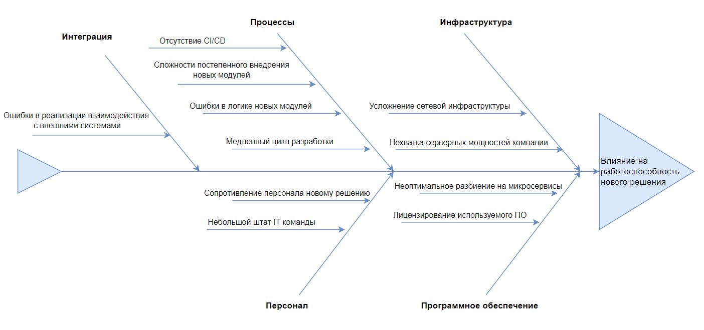

# Оценка узких мест при миграции

## Диаграмма Исикавы

[Диаграмма в drawio](Ishicawa.drawio)

## Отчет по оценке узких мест

### Инфрастуктура

* Нехватка серверных мощностей компании

Решение: Закупка нового серверного оборудования и/или аренда облачной инфрастуктуры. Использование автомасштабирования для Kubernetes.

Приоритет:Высокий

* Усложнение сетевой инфрастуктуры

Решение: Найм квалифицированных DevOps-инженеров. Активное внедрение Kubernetes, Helm-chart для разворачивания (микро)сервисов

Приоритет: Высокий

### Программное обеспечение

* Неоптимальное разбиение на микросервисы

Решение: Тщательное проектирование микросервисов с использованием DDD.

Приоритет: Высокий

* Лицензирование используемого ПО

Решение: Найм или аутстаф юриста с соответствующей компетенцией.

Приоритет: Средний

### Процессы

* Медленный цикл разработки

Решение: Разработка с использованием feature-toggle'ов для ускорения вывода нового функционала в релиз.

Приоритет: Высокий

* Ошибки в логике новых модулей

Решение: Тщательное тестирование логики новых модулей, тестирование на реальных, но обезличенных данных.

Приоритет: Средний

* Сложности постепенного внедрения новых модулей

Решение: Parallel Run (запуск старой и новой систем бок о бок)

Приоритет: Средний

* Отсутствие CI/CD

Решение: Автоматизация тестирования. Активное привлечение DevOps-инженеров к решению задач автоматизации.

Приоритет: Высокий

### Персонал

* Сопротивление персонала новому решению

Решение: Внедрять новые модули постепенно. Демонстрация преимуществ новой системы.

Приоритет: Средний.

* Небольшой штат IT команды

Решение: Найм или обучение IT специалистов требуемых компетенций. Возможно, аутсорс или аутстаф.

Приоритет: Критичный.

### Интеграция

* Ошибки в реализации взаимодействия с внешними системами

Решение: Тщательное документирование протоколов общения (OpenAPI, AsyncAPI)

Приоритет: Высокий
